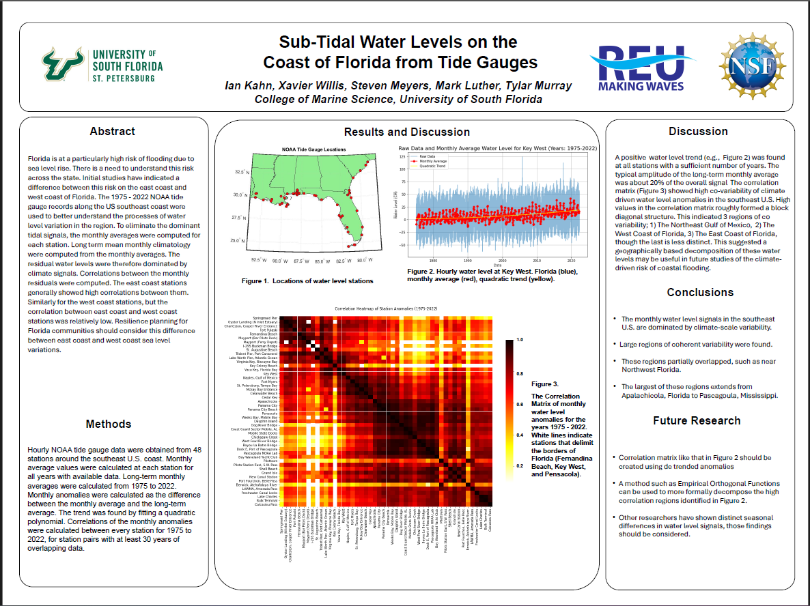

# ExploreMarineDataUsf

# **Sub-Tidal Water Levels on the Coast of Florida from Tide Gauges**

Project Overview
This project, led by Dr. Meyers, focuses on analyzing marine water level data and generating comprehensive visualizations to enhance data interpretation. Using Python, the research investigates monthly anomalies in water levels across various NOAA tide gauge stations.

Key Features
Data Processing:

Load and process NOAA water level data from .mat files.

Convert and standardize datetime formats for time series analysis.

Anomaly Analysis:

Calculate monthly averages.

Compute anomalies relative to long-term climatological means.

Correlation Analysis:

Generate correlation matrices to visualize relationships between different NOAA stations.

Identify stations with significant correlation patterns.

Visualization:

Create detailed heatmaps to depict correlation strengths across stations.

Produce clear and informative figures to support data insights.

Goals
Provide a better understanding of water level variation patterns.

Identify regional similarities and differences in water level anomalies.

Create reusable Python scripts for ongoing marine data analysis.

